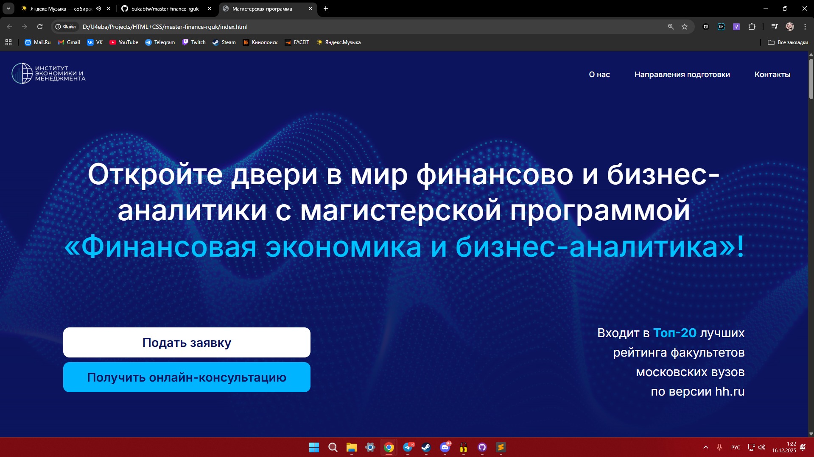
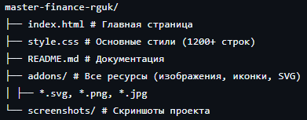

# Лендинг магистерской программы «Финансовая экономика и бизнес-аналитика» РГУ им. А.Н. Косыгина

**Промо-сайт** для привлечения абитуриентов на магистерскую программу по финансовой экономике и бизнес-аналитике.



## 📌 О проекте

Проект разработан по запросу преподавателя **РГУ им. А.Н. Косыгина** для продвижения магистерской программы «Финансовая экономика и бизнес-аналитика». После успешной реализации первого лендинга, меня привлекли к созданию этого более сложного проекта.

**Особенности задачи:**
- Создание современного, корпоративного дизайна в синей цветовой гамме
- Адаптация сложного контента (статистика, преимущества, сетка партнёров)
- Реализация интерактивных элементов (FAQ-аккордеон)
- Вёрстка нетривиальных сеток с использованием CSS Grid

## 🛠️ Технологии

*   **HTML5** — семантическая разметка, доступность
*   **CSS3** — CSS Grid Layout, Flexbox, адаптивная вёрстка, CSS-переменные
*   **JavaScript (Vanilla JS)** — реализация без библиотек:
    *   Аккордеон (FAQ) с анимацией открытия/закрытия
    *   Адаптивное мобильное меню-бургер
    *   Обработка состояний элементов
*   **CSS Grid** — сложные макеты (12-колоночная сетка для секций преимуществ и статистики)
*   **Адаптивность** — полная поддержка мобильных устройств и планшетов

## ✨ Ключевые особенности

### 🎯 Сложные макеты
*   **12-колоночная сетка** для секций "Преимущества" и "Статистика"
*   **Гибкие карточки** с переменной шириной (wide, wider)
*   **Нестандартное расположение** элементов в секции "Почему стоит выбрать"

### 📱 Адаптивность
*   Полная перестройка макетов на мобильных устройствах
*   Гибкие изображения и типографика
*   Удобная навигация в мобильной версии

### 🎨 Дизайн
*   Корпоративная синяя цветовая гамма (#0b145c, #00c2ff)
*   Градиенты и наложенные фоновые изображения
*   Согласованная типографика (шрифт Inter)
*   Проработанные карточки с тенями и скруглениями

### ⚡ Интерактивность
*   FAQ-аккордеон с плавной анимацией
*   Интерактивные кнопки и ссылки
*   Адаптивное меню с бургер-иконкой

## 🚀 Запуск проекта

Проект статический. Чтобы посмотреть его локально:

1.  Склонируй репозиторий:
    ```bash
    git clone https://github.com/bukabtw/master-finance-rguk.git
    ```
2.  Открой файл `index.html` в любом современном браузере.

**Или посмотри демо:** [Посмотреть работающий сайт](https://bukabtw.github.io/master-finance-rguk/) 

## 📁 Структура проекта



## 📸 Скриншоты

*Секция "Почему стоит выбрать" с нестандартной сеткой*  


*Сложная 12-колоночная сетка преимуществ*  


*Сетка статистики университета*  


*Аккордеон FAQ с JavaScript*  


*Секция партнёров с адаптивной сеткой логотипов*  


...

## 📈 Что было сложным и как решалось

* **Сложная сетка преимуществ** — использована 12-колоночная CSS Grid с точным позиционированием каждого элемента
* **Адаптация под мобильные устройства** — полная перестройка сеток на медиа-запросах
* **Большое количество контента** — организация в логические блоки с визуальной иерархией
* **Работа с брендингом** — соблюдение корпоративных цветов университета

## 🔧 Технические детали

### CSS Grid в действии
```css
/* Пример сложной сетки */
.benefits-row-1 {
  display: grid;
  grid-template-columns: repeat(12, 1fr);
  gap: 24px;
}

.benefits-row-1 h2 {
  grid-column: 1 / span 6;
}

.benefits-row-1 .card.wide {
  grid-column: 7 / span 6;
}
```
### Чистый JS для аккордеона
```JavaScript
document.querySelectorAll('.faq-question').forEach(button => {
  button.addEventListener('click', () => {
    const isActive = button.classList.toggle('active');
    button.nextElementSibling.style.display = isActive ? 'block' : 'none';
  });
});
```

## 🎯 Результат

Проект успешно принят преподавателем и адаптировался им для продвижения магистерской программы. Код демонстрирует умение работать со сложными макетами, адаптивной вёрсткой и базовым JavaScript.

## 🔗 Ссылки

*   **Демо (GitHub Pages):** [Посмотреть работающий сайт](https://bukabtw.github.io/master-finance-rguk/)
*   **Итоговый сайт с правками преподавателя:** [Итоговый вариант преподавателя](https://eimrsukosygin.ru/)

---
## 👨‍💻 Автор

**Кирилл Букарев**  
Frontend-разработчик / Студент

📫 **Контакты:**
- Telegram: [@bukabtw](http://t.me/bukabtw)
- Email: [bukarev.k11@gmail.com](mailto:bukarev.k11@gmail.com)
- GitHub: [bukabtw](https://github.com/bukabtw)

*Выполнено в 2024 году по запросу преподавателя РГУ им. А.Н. Косыгина.*